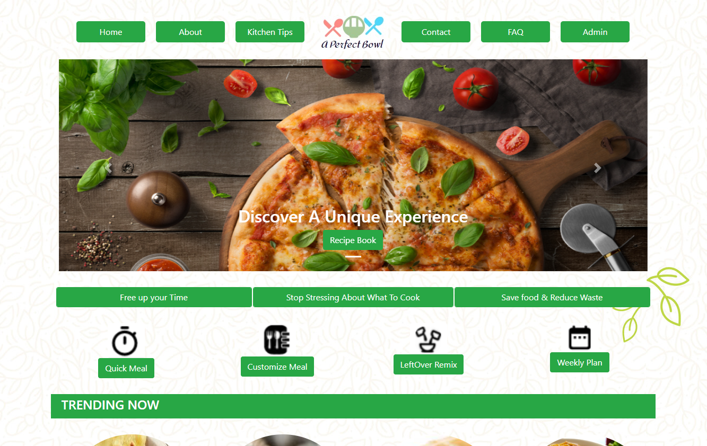

##

# A Perfect Bowl

Created this application with Frontend: HTML, CSS, bootstrap, javascript, Backend: PHP, MySQL. This
application is for the people who want to explore different recipes at one stop and also added a feature where the
user can find the recipes with the ingredients leftover in there fridge and also plan multiple meals for each day. We
also have a feature where your filter your recipes according to the duration. In this application the admin can
manage the recipes

# Testing

In this project, I have Designed and implemented automation scripts using Selenium IDE and Selenium Webdriver.
Written test cases and test plans, executed test scripts, and reporting defects.Reviewed test plans and procedures to
ensure system requirements were met.Used JIRA Software Testing tools to manage project tasks and bugs
effectively across teams.
